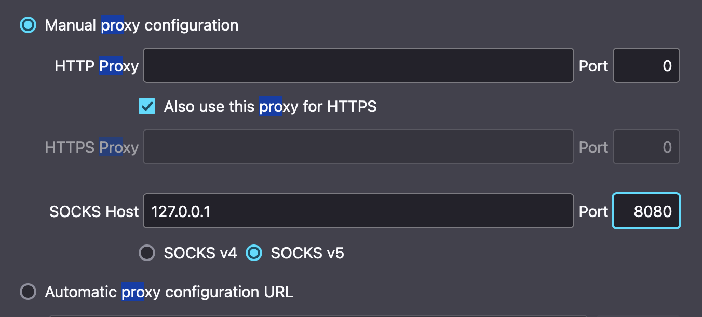

QProxy
======

QProxy is a simple proxy server that can be used to forward requests to a different server. It is written in Rust and uses the `socket` module to create a server that listens for incoming connections. When a connection is received, the server reads the request and forwards it to the specified server. The response from the server is then sent back to the client.

## Usage

```shell
cargo build --release
```

```shell
./target/release/qproxy <port> <proxy>
```

## Example

```shell
./target/release/qproxy -p 8080 --proxy ip:port:username:password
```

## Code Example
```rust
use qproxy::{Config, ForwardProxy};

pub struct Config {
    #[arg(short, long, default_value_t = 8080)]
    pub port: i16,
    #[arg(long)]
    pub proxy: String,
}


#[tokio::main]
async fn main() -> Result<(), Box<dyn std::error::Error>> {
    let config = Config::parse();
    let server = ForwardProxy::new(config.port as u16, config.proxy).await?;
    server.start().map_err(|e| e.into())
}
```

## Config FireFox Proxy

`socks5://127.0.0.1:8080`

